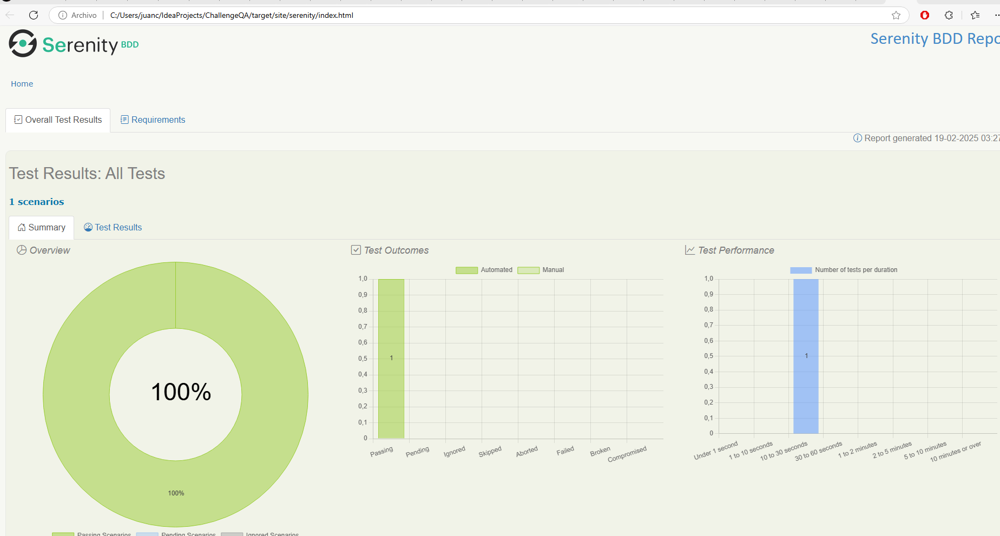

Autor: Juan Carlos Gonzalez Ortiz

www.linkedin.com/in/juan-carlos-gonzalez-3b566598

# Challenge QA Serenity con ScreenPlay
Pagina automatizada: https://www.saucedemo.com/

Funciones automatizadas: Carrito de compras

Patrón de diseño: Screenplay

Framework: gherkin, cucumber, SerenityBDD 3.3.4, selenium

Plugins adicionales: cucumber for java, Gherkin

Lenguaje programacion: Java

version gradle: gradle-7.6.1

OPEN_JDK Version 17.0.9

Driver Selenium: Edge(modo automático de versión)

IDE: Intellij IDEA  2024.3.3

## **PASOS PARA LA EJECUCIÓN**
1. Tener seteada la variable JAVA_HOME y Gradle(dentro del Path) seteadas como variables de sistema

2.Para compilar el proyecto y preparar todo para la ejecución, ejecuta el comando gradle clean build. Este comando limpia cualquier compilación anterior y compila el proyecto desde cero.
Se adjunta un video demostrativo de la aplicación ejecutándose
https://youtu.be/Ki0_k9dfaKk

## **Reportes**
El main report de Serenity-Cucumber se genera automáticamente luego de la ejecución en el directorio "../IdeaProjects/ChallengeQA/target/site/serenity/index.html"
